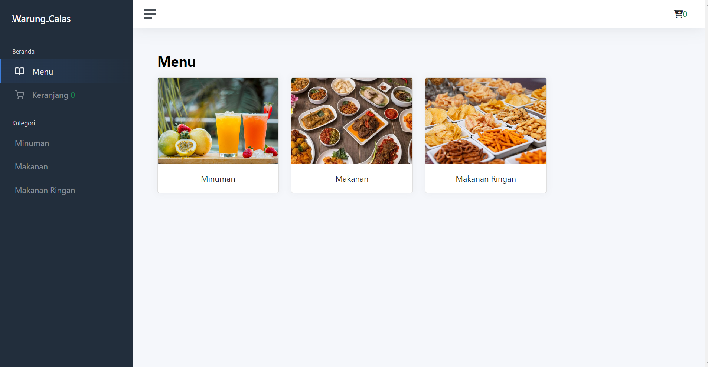
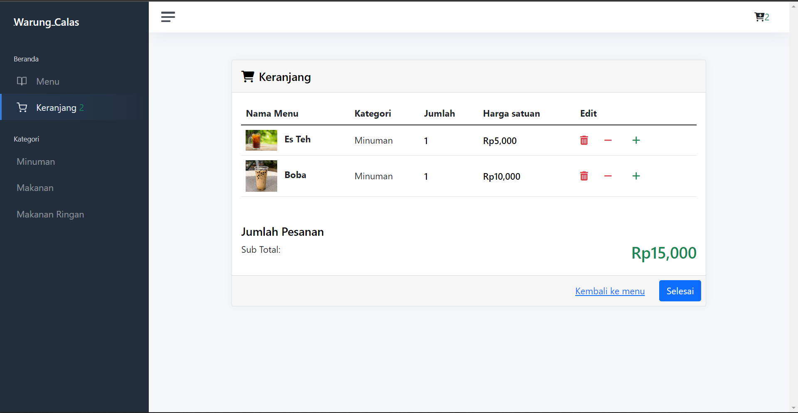

# Web-Pos-restoran
Web Point of Sale menggunakan framework laravel
<br>
framework yang digunakan `laravel` 
<br>
laravel: `9.52.4`

# Fitur
- Tambah;update;hapus;lihat data kategori, produk, dan kasir.
- Tampilan home untuk customer
- Tampilan Homepage untuk admin
- Tampilan Homepage untuk Kasir

# Screenshoot
<details>
    <summary>Foto Web</summary>
    <br>

|  |  |
| :---:  | :---:  |
|             |           
  |             
               |   
            |         
            |   


</details>  

# Cara install

#### Via Git
```bash
git clone https://github.com/EriSetyawan166/web-pos-restoran.git
```

### Download ZIP
[Link](https://github.com/EriSetyawan166/web-pos-restoran/archive/refs/heads/master.zip)

### Setup Aplikasi
Jalankan perintah 
```bash
composer install --ignore-platform-reqs
```
Copy file .env dari .env.example
```bash
copy .env.example .env
```
Konfigurasi file .env
```bash
DB_CONNECTION=mysql
DB_HOST=127.0.0.1
DB_PORT=3306
DB_DATABASE=nama_database
DB_USERNAME=root
DB_PASSWORD=
```
Generate key
```bash
php artisan key:generate
```
Migrate database
```bash
php artisan migrate
```
Seeder table
```bash
php artisan db:seed
```

Update Composer
```bash
composer update
```

Menjalankan aplikasi
```bash
php artisan serve
```

username: admin
<br>
password: admin
<br>
<br>
username: kasir
<br>
kasir   : kasir

## Contributors ✨
<table>
  <tr>
    <td align="center"><a href="https://github.com/EriSetyawan166"><br /><sub><b>Muhammad Eri Setyawan</b></sub></a><br/><a href="#" title="Code">💻</a> <a href="#" title="Documentation">📖</td>
    <td align="center"><a href="https://github.com/BayuPrap"><br /><sub><b>Maulana Krisna</b></sub></a><br/><a href="#" title="Bug reports">🐛</a> <a href="#" title="erd, database">📙</a></td>
    <td align="center"><a href="#"><br /><sub><b>Bariq Gian Gumilang</b></sub></a><br/><a href="#" title="Bug reports">🐛</a> <a href="#" title="Ideas, Planning, & Feedback">🤔</a></td>
  </tr>
</table>
